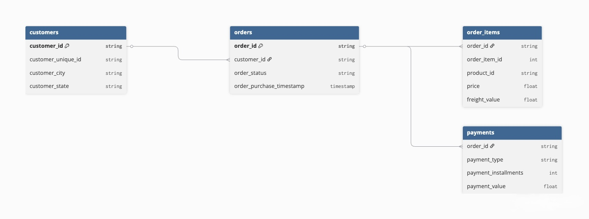
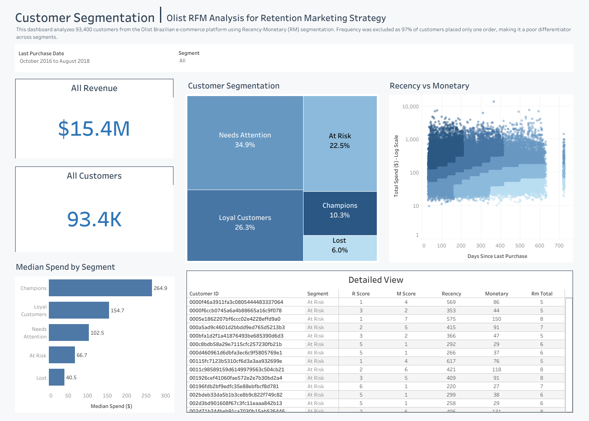

# Olist Customer Segmentation Analysis

**97% of Olist's 93,357 customers never place a second order.** This project identifies who those customers are, what they're worth, and what to do about it.

---

## Project Background

Olist is a Brazilian e-commerce platform, founded in 2015, that connects small and medium-sized merchants to customers across Brazil through a centralized online marketplace. Operating on a marketplace model, Olist generates revenue through seller subscriptions and transaction fees across product categories ranging from electronics to fashion.

Olist has accumulated significant transaction data across thousands of sellers and customers that has been underutilized for customer retention strategy. This project analyzes customer purchasing behavior to segment Olist's customer base and uncover retention opportunities that can improve customer lifetime value and reduce churn.

Insights and recommendations are provided on the following key areas:

- **Customer Segmentation:** Classification of 93,357 customers into five distinct behavioral segments using Recency-Monetary (RM) analysis
- **Retention Analysis:** Evaluation of purchasing patterns revealing a critical single-order retention gap across the business
- **Segment Value Analysis:** Assessment of median spend and recency across segments to prioritize marketing investment
- **Marketing Recommendations:** Targeted retention strategies per segment designed to maximize revenue impact while minimizing unnecessary spend

The Python notebook used for data cleaning, EDA, SQL queries, and RM scoring can be found [here](rfm_analysis.ipynb).

An interactive Tableau dashboard can be viewed [here](https://public.tableau.com/views/CustomerSegmentation-Olist/Dashboard?:language=en-US&publish=yes&:sid=&:redirect=auth&:display_count=n&:origin=viz_share_link).

---

## Data Structure & Initial Checks

Olist's database contains 9 tables covering the full e-commerce operation. This analysis focuses on 4 tables directly relevant to customer purchasing behavior: `orders`, `order_items`, `customers`, and `payments` across 96,477 transactions from 93,357 unique customers.

Prior to beginning the analysis, a variety of checks were conducted for quality control and familiarization with the datasets. The SQL queries used to inspect and clean the data can be found in the notebook linked above.

---

## Executive Summary

### Methodology
RFM is a customer segmentation technique that scores customers based on three behavioral dimensions: Recency (how recently they purchased), Frequency (how often they purchase), and Monetary (how much they spend). In this analysis, Frequency was excluded because 97% of customers placed only one order, making it a poor differentiator across segments. Each customer was scored on a 1–10 decile scale across Recency and Monetary and assigned to one of five segments based on their combined score. Median spend was used instead of average to account for high-value outliers in the dataset.

### Overview of Findings

Analysis of 93,357 customers across 96,477 transactions reveals a critical retention gap: 97% of customers place only one order and never return. Segmenting the customer base by recency and spend uncovers a 6.6x difference in median spend between Champions ($265) and Lost customers ($40), with the largest segment — Needs Attention at 35% of the base — representing the highest-ROI re-engagement opportunity. Improving retention even marginally would generate significant incremental revenue at a fraction of new customer acquisition cost.

Below is the overview page from the Tableau dashboard. The entire interactive dashboard can be viewed [here](https://public.tableau.com/views/CustomerSegmentation-Olist/Dashboard?:language=en-US&publish=yes&:sid=&:redirect=auth&:display_count=n&:origin=viz_share_link).

### Customer Behavior Trends:

| Segment | Customers | % of Base | Median Spend |
|---|---|---|---|
| Champions | 9,631 | 10% | $265 |
| Loyal Customers | 24,580 | 26% | $155 |
| Needs Attention | 32,571 | 35% | $103 |
| At Risk | 20,972 | 22% | $67 |
| Lost | 5,603 | 6% | $40 |

- Champions spend **6.6x more** than Lost customers at median, making protecting this group the single highest-ROI action available
- The Needs Attention segment is the largest at 35% of the base and represents the biggest re-engagement opportunity
- At Risk and Lost customers combined make up 28% of the base but generate the least revenue; minimizing spend here frees budget for higher-value segments
- The data reveals a clear drop-off in both recency and spend as customers move from Champions to Lost

### Recommendations:

Each segment requires a distinct strategy to maximize retention ROI.

#### Champions: Protect & Reward
- Launch a VIP early access or loyalty program to reward and retain them
- Leverage this group for product feedback and reviews as they are most likely to respond
- **Do not discount.** They buy at full price and discounting erodes margin unnecessarily

#### Loyal Customers: Nurture & Upsell
- Target with personalized recommendations based on past purchase categories
- Offer a small incentive such as free shipping or a small discount to drive a repeat purchase
- Priority segment for upsell campaigns

#### Needs Attention: Re-Engage Now
- Launch a time-limited re-engagement email campaign
- Sub-segment by recency and prioritize customers who purchased within the last 6 months
- A/B test messaging to identify what drives conversion

#### At Risk: Win Back Before It's Too Late
- Deploy a win-back campaign with a meaningful discount of 15-20%
- Highlight new products or categories they haven't tried
- Set a marketing spend cap for customers with low monetary scores

#### Lost: Minimize Spend
- Send one final win-back email, then suppress from future campaigns
- Redirect saved budget toward Champions and Loyal Customers

---

## Assumptions & Caveats

- **Frequency excluded from RFM scoring:** With 97% of customers placing exactly one order, Frequency adds no meaningful differentiation across segments and was dropped in favor of a Recency-Monetary (RM) model
- **Median spend used over average:** The dataset contains high-value outliers that skew averages upward; median provides a more representative measure of typical spend per segment
- **Cancelled and incomplete orders excluded:** Only successfully delivered orders were included in the analysis to ensure spend figures reflect actual revenue

---

### Bottom Line
Improving retention by even 5% across the Needs Attention segment would generate significant incremental revenue without additional acquisition cost, representing the highest ROI opportunity available to the marketing team.
